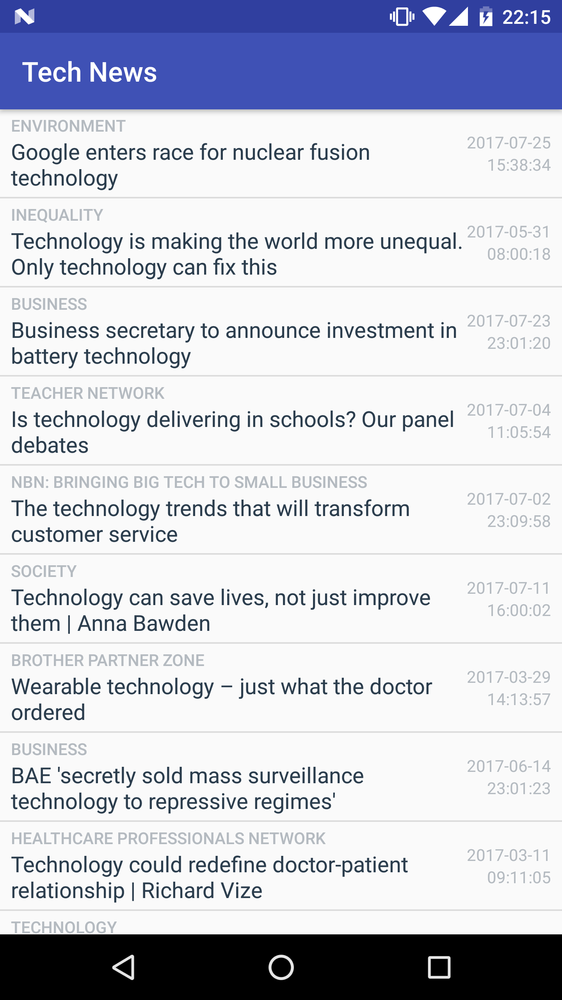

# Android Technology News App

- Project **News App** of Android Basics Nanodegree
- [Android Basics Nanodegree at Udacity.com](https://www.udacity.com/course/android-basics-nanodegree-by-google--nd803)

## Android Items

- HttpURLConnection.
- Loaders (AsyncTaskLoader)
- StringBuilders.
- JSON Parsing.
- ArrayAdapter.
- ListView.

# Description
- Get the latest Technology News
- Retrieves data from The Guardian API
- Only the first 10 results will be displayed
- Swipe down to refresh the news list
- Tap any item to open the article in your browser

# Screenshot
